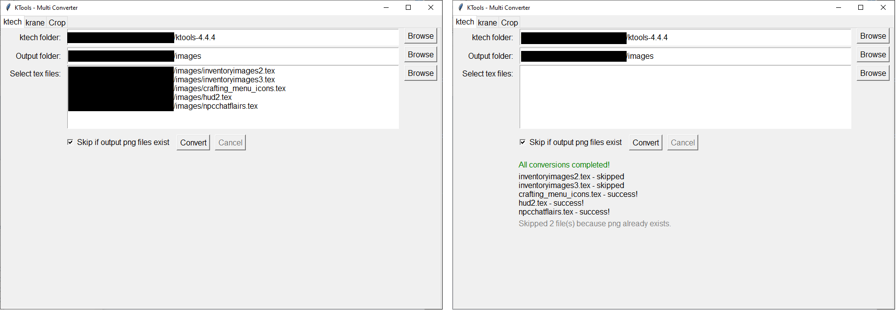
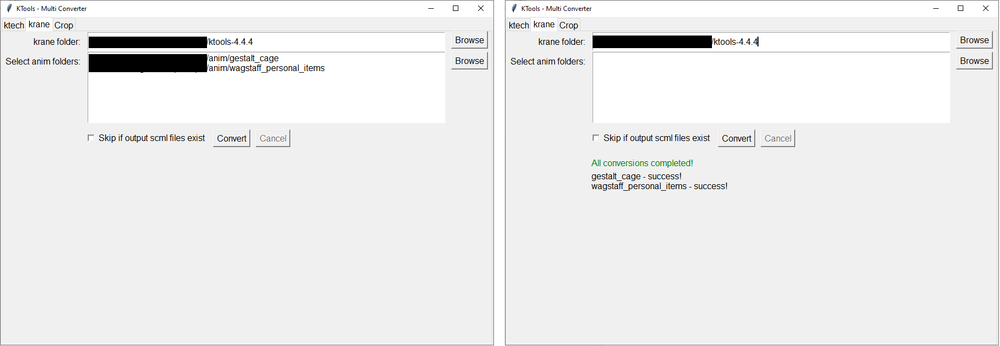
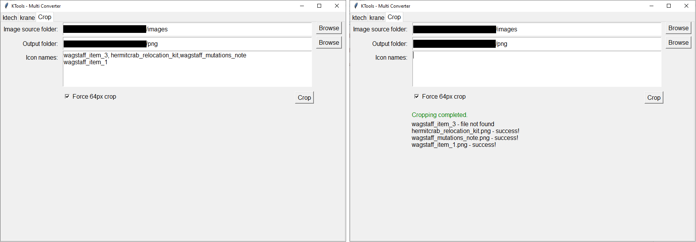

# KTools UI

> **Warning**  
> This code was written with the help of Perplexity AI.

KTools UI is a Python application for batch converting files using **ktech** (tex → png) and **krane** (anim → scml) from [KTools](https://forums.kleientertainment.com/files/file/583-ktools-cross-platform-modding-tools-for-dont-starve/). The interface supports file/folder selection, batch processing, skipping existing outputs, and canceling ongoing conversions. It is mainly used for Don't Starve (Together).

## Features
- **ktech tab**:
  - Select multiple `.tex` files for batch conversion
  - Option to skip conversion if png already exists
- **krane tab**:
  - Select multiple animation folders for batch conversion
  - Option to skip conversion if output files already exist
- **Crop tab**:
  - Crop multiple images from xml and png files.

## Installation

1. **Clone this repository:**
   ```bash
   git clone https://github.com/yourusername/ktools-ui.git
   cd ktools-ui
   ```

2. **Install requirements:**
   - Python 3.7 or higher is required.
   - Tkinter is included with most Python installations.
   - No external dependencies are required.

3. **Download KTools:**
   - You must have the [KTools binaries (ktech, krane)](https://forums.kleientertainment.com/files/file/583-ktools-cross-platform-modding-tools-for-dont-starve/) for converting.

## Usage

1. **Run the application:**
   ```bash
   python ktoolsUI.py
   ```

2. **ktech Tab (tex → png):**
   - Select the ktech folder and output folder.
   - Select one or more `.tex` files.
   - (Optional) You can choose if you want to skip if output PNG exists.
   - Click **Convert** to start. Click **Cancel** to interrupt.
   
3. **krane Tab (anim → scml):**
   - Select the krane folder.
   - Add one or more animation folders (each folder must include at least one `anim.bin`, one `.tex`, and one `build.bin`).
   - (Optional) You can choose if you want to skip if output files exists.
   - Click **Convert** to start. Click **Cancel** to interrupt.
   
4. **Crop Tab**
   - Select source folder that contain xml files and png fils.
   - Select output folder.
   - Enter image names that you want to crop, separated by comma or newline.
   - Click **Crop** to start.
   
## Notes
- The app remembers the last used folders in `ktoolsUI_config.ini` in the same directory.

## Known Issues
- In krane tab, only one folder can be selected at a time.
- When Cancel the process, it will still finish the current running one.